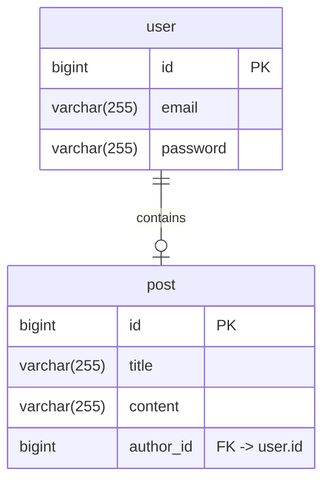

# wanted-pre-onboarding-backend

developed by 이건호

## 애플리케이션 실행

도커 환경 준비 후 아래 명령어를 차례로 실행하세요.

```shell
$ ./gradlew bootBuildImage # 도커 이미지를 빌드합니다.
$ docker compose up
```

콘솔에 `Started WantedPreOnboardingBackendApplication in xxx seconds...` 메세지가 출력되면 애플리케이션이 준비된 상태입니다.

## API

API 실행을 위해 cURL 이 필요합니다.

### 회원가입

- Method : `POST`
- URI : `/users/sign-up`
- Request :
  ```typescript
  type Request = {
    email: string;
    password: string;
  };
  ```
    - email 에는 @ 가 있어야 합니다.
    - password 는 8자리 이상이어야 합니다.
- Response :
  ```typescript
  // 200 OK
  // 회원가입 성공
  type Response = {
    user: {
      id: string;
      email: string;
    };
  };
  ```
  ```typescript
  // 400 Bad Request
  // email 이나 password 가 조건에 맞지 않을 때
  type Response = {
    message: string;
  };
  ```
  ```typescript
  // 409 Conflict
  // 이미 사용중인 email 일 때
  type Response = {
    message: string;
  };
  ```
- 실행 :
  ```shell
  curl --location 'http://localhost:8080/users/sign-up' \
  --header 'Content-Type: application/json' \
  --data-raw '{
    "email": "{{사용할 이메일}}",
    "password": "{{사용할 비밀번호}}"
  }'
  ```

### 로그인

- Method : `POST`
- URI : `/users/sign-in`
- Request :
  ```typescript
  type Request = {
    email: string;
    password: string;
  };
  ```
    - email 에는 @ 가 있어야 합니다.
    - password 는 8자리 이상이어야 합니다.
- Response :
  ```typescript
  // 200 OK
  // 로그인 성공
  // 발급받은 token 은 이후 Authorization 헤더에 Bearer {{token}} 형태로 사용
  type Response = {
    user: {
      id: string;
      email: string;
    };
    token: string;
  };
  ```
  ```typescript
  // 400 Bad Request
  // email 이나 password 가 조건에 맞지 않을 때
  type Response = {
    message: string;
  };
  ```
  ```typescript
  // 401 Unauthorized
  // 비밀번호가 틀렸을 때
  type Response = {
    message: string;
  };
  ```
- 실행 :
  ```shell
  curl --location 'http://localhost:8080/users/sign-in' \
  --header 'Content-Type: application/json' \
  --data-raw '{
    "email": "{{로그인할 이메일}}",
    "password": "{{로그인할 비밀번호}}"
  }'  
  ```

### 게시글 생성

- Method : `POST`
- URI : `/posts`
- Request :
  ```typescript
  type Header = {
    Authorization: string; 
  };
  type Request = {
    title: string;
    content: string;
    author: {
      id: string;
    };
  };
  ```
    - Authorization 헤더에 `Bearer {{token}}` 을 추가해야 합니다. token 에는 로그인할 때 발급받은 토큰을 사용합니다.
    - author.id 는 로그인한 사용자의 아이디여야 합니다.
- Response :
  ```typescript
  // 200 OK
  // 게시글 작성 성공
  type Response = {
    post: {
      id: string;
      title: string;
      content: string;
      author: {
        id: string;
      };
    };
  };
  ```
  ```typescript
  // 400 Bad Request
  // 요청 데이터에 누락이 있거나 잘못되었을 때
  type Response = {
    message: string;
  };
  ```
  ```typescript
  // 401 Unauthorized
  // Authorization 헤더의 토큰이 잘못되었을 때
  type Response = {
    message: string;
  };
  ```
  ```typescript
  // 403 Forbidden 
  // 로그인한 사용자와 게시글의 작성자가 다를 때
  type Response = {
    message: string;
  };
  ```
- 실행 :
  ```shell
  curl --location 'http://localhost:8080/posts' \
  --header 'Authorization: Bearer {{token}}' \
  --header 'Content-Type: application/json' \
  --data '{
    "title": "{{게시글 제목}}",
    "content": "{{게시글 내용}}",
    "author": {
      "id": "{{작성자 id}}"
    }
  }'
  ```

### 게시글 조회

- Method : `GET`
- URI : `/posts/{{postId}}`
- Request :
    - postId 는 조회할 게시글의 id 입니다.
- Response :
  ```typescript
  // 200 OK
  // 게시글 조회 성공
  type Response = {
    post: {
      id: string;
      title: string;
      content: string;
      author: {
        id: string;
      };
    };
  };
  ```
  ```typescript
  // 404 Bad Request
  // 요청한 게시글이 없을 때
  type Response = {
    message: string;
  };
  ```
- 실행 :
  ```shell
  curl --location 'http://localhost:8080/posts/{{postId}}' 
  ```

### 게시글 수정

- Method : `PUT`
- URI : `/posts/{{postId}}`
- Request :
  ```typescript
  type Header = {
    Authorization: string; 
  };
  type Request = {
    title: string;
    content: string;
  };
  ```
    - postId 는 수정할 게시글의 id 입니다.
    - Authorization 헤더에 `Bearer {{token}}` 을 추가해야 합니다. token 에는 로그인할 때 발급받은 토큰을 사용합니다.
    - 자신이 쓴 게시글만 수정할 수 있습니다.
- Response :
  ```typescript
  // 200 OK
  // 게시글 수정 성공
  type Response = {
    post: {
      id: string;
      title: string;
      content: string;
      author: {
        id: string;
      };
    };
  };
  ```
  ```typescript
  // 400 Bad Request
  // 요청 데이터에 누락이 있거나 잘못되었을 때
  type Response = {
    message: string;
  };
  ```
  ```typescript
  // 401 Unauthorized
  // Authorization 헤더의 토큰이 잘못되었을 때
  type Response = {
    message: string;
  };
  ```
  ```typescript
  // 403 Forbidden 
  // 로그인한 사용자와 게시글의 작성자가 다를 때
  type Response = {
    message: string;
  };
  ```
  ```typescript
  // 404 Not Found
  // 요청한 게시글이 없을 때
  type Response = {
    message: string;
  };
  ```
- 실행 :
  ```shell
  curl --location --request PUT 'http://localhost:8080/posts/{{postId}}' \
  --header 'Authorization: Bearer {{token}}' \
  --header 'Content-Type: application/json' \
  --data '{
    "title": "{{수정할 게시글 제목}}",
    "content": "{{수정할 게시글 내용}}"
  }'
  ```

### 게시글 삭제

- Method : `DELETE`
- URI : `/posts/{{postId}}`
- Request :
    - postId 는 삭제할 게시글의 id 입니다.
    - Authorization 헤더에 `Bearer {{token}}` 을 추가해야 합니다. token 에는 로그인할 때 발급받은 토큰을 사용합니다.
    - 자신이 쓴 게시글만 삭제할 수 있습니다.
    - 멱등성을 만족합니다. 존재하지 않는 게시글에 대한 삭제 요청은 성공으로 처리합니다.
- Response :
  ```typescript
  // 200 OK
  // 게시글 삭제 성공
  type Response = {
    message: string;
  };
  ```
  ```typescript
  // 401 Unauthorized
  // Authorization 헤더의 토큰이 잘못되었을 때
  type Response = {
    message: string;
  };
  ```
  ```typescript
  // 403 Forbidden 
  // 로그인한 사용자와 게시글의 작성자가 다를 때
  type Response = {
    message: string;
  };
  ```
- 실행 :
  ```shell
  curl --location --request DELETE 'http://localhost:8080/posts/{{postId}}' \
  --header 'Authorization: Bearer {{token}}'
  ```

### 게시글 목록 조회

- Method : `GET`
- URI : `/posts?cursor={{postId}}&count={{postNum}}`
- Request :
    - 게시글 id 기준 내림차순으로 조회합니다.
    - cursor 로 전달한 postId 보다 작은 글 목록을 조회합니다.
    - cursor 가 없으면 가장 최신 게시글부터 조회합니다.
    - count 는 조회할 게시글 숫자입니다.
    - count 가 없으면 10개를 기본으로 조회합니다.
- Response :
  ```typescript
  // 200 OK
  // 게시글 목록 조회 성공
  // 조회할 게시글이 남아있는 경우 hasNext 가 true
  type Response = {
    posts: Array<{
      id: string;
      title: string;
      content: string;
      author: {
        id: string;
      };
    }>;
    hasNext: boolean;
  };
  ```
- 실행 :
  ```shell
  curl --location 'http://localhost:8080/posts'
  ```

## 데이터베이스 테이블 구조


